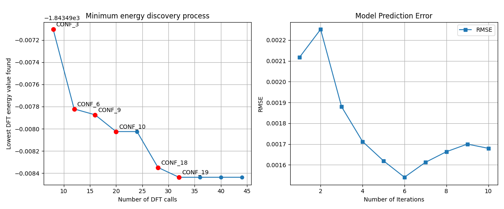

An Active Learning framework designed to ​minimize the use of costly DFT computations​ in the search for global minimum energy configurations of molecular systems. The algorithm leverages inexpensive g-xTB pre-screening and iterative surrogate model training (like linear regression) to decide the most promising candidates for subsequent DFT evaluation. This method efficiently navigates the conformational space, aiming to find the global energy minimum with a fraction of the full computational cost. Includes scripts for simulation, analysis, and visualization of the learning process.

## 混合精度的构象系综分析

混合精度构象系综采样与分析采用多级别能量评估方案：初始阶段依靠低精度力场快速筛除不可行构象；随后通过半经验量子化学（SQM）或其它低计算的方法实施几何弛豫与构象去重；最后执行 DFT 单点能计算，依据高精度能量对构象系综重新排序。

所有的策略都是回答一个问题：能不能从初始的构象系综中进一步筛掉一部分构象，使 DFT 计算量显著下降，同时保证筛选后的子集仍然包含完整 DFT 计算所得的低能构象？或者说：从一个较大的初始构象系综中，寻找一个尽可能小的子集，使其能够覆盖该初始系综所产生的全部 DFT 低能构象。这个问题可以在两个不同的时间点思考：

### 1. 正在进行DFT计算：早期停止评估

需要评估继续计算的潜在收益，停止计算的潜在损失，剩余全量计算的成本，当前DFT计算的系综已经覆盖了多大的空间？

输入类似：
```
CREST/xTB：1000 个 conformers
DFT SPE：100 / 1000 已完成
```
此时关心的是：

- 继续算下去还有多少潜在价值？
- 剩余构象中还可能有多少个 DFT 目标？
- 如果现在停止，漏掉目标的风险多大？
- 继续计算还需要多少资源？
- 当前已经完成的 DFT 结果，对 xTB 预筛选的支持程度如何？

### 2. 已经完成DFT计算：初始的构象空间可以缩减到多小，同时仍然回收 100% 的 DFT 低能构象？

输入类似：
```
CREST/xTB：1000
DFT SPE：1000 / 1000
```
此时关心的是：

- 原始的构象系综是否足够，是否有证据证明不够？
- 如果不够，是 DFT 计算不够，还是更根本的起始构象（力场阶段、SQM阶段）空间不够？
- 如果重新做一次这个项目，初始的构象空间可以缩减到多小，同时仍然回收 100% 的 DFT 低能构象？

这两个问题构成一个闭环:

```
                 Low-cost conformational ensemble
                              │
                              ▼
                    ┌─────────────────┐
                    │  Initial CREST  │
                    │ / xTB ensemble  │
                    └────────┬────────┘
                             │
                expensive DFT SPE calculations
                             │
                 ┌───────────┴───────────┐
                 │                       │
             DFT进行中                 DFT完成
                 │                       │
                 ▼                       ▼
        Early Stopping          Final Ensemble Reduction
        提前停止评估               最终构象缩减评估
                 │                       │
                 │                       │
        “现在停是否合理？”       “事后最少可以保留多少？”
                 │                       │
                 └───────────┬───────────┘
                             ▼
                  优化下一轮计算策略
```

问题的本质：优化“低计算量方法的构象系综 → DFT构象系综”这条计算链条中的高精度计算资源分配。

总的来说，不是要证明 xTB 是不是“足够准确”，也不是要证明起始构象系综是否找到了所有构象，而是利用低成本构象生成与高精度 DFT 结果之间的实际关系，寻找 DFT 资源投入的最小充分范围。而是mixed-precision conformational ensemble resource allocation / early stopping framework。

### 示例

Flare进行初始的基于力场的构象搜索、Flare Ligand QM进行几何优化(xTB GFN2)、构象去重，得到起始的构象系综（xtb_ensemble.sdf）, 接着在R2SCAN-3c理论水平进行单点能计算（ensemble_spe.sdf）, 现在要评估DFT ewin=3 kcal/mol 构象系综。

```bash
./dft_ensemble_ana.py --crest xtb_ensemble.sdf --spe ensemble_spe.sdf --ewin 3

======================================================================
Input Ensemble Summary
======================================================================
Total conformers                  : 25
xTB energy window                 : 7.78 kcal/mol

Conformers <= 1 kcal/mol        : 6
Conformers <= 2 kcal/mol        : 6
Conformers <= 3 kcal/mol        : 13
Conformers <= 4 kcal/mol        : 13
Conformers <= 5 kcal/mol        : 13
Conformers <= 6 kcal/mol        : 20

======================================================================
DFT Progress
======================================================================
DFT completed                     : 25 / 25
Completion                        : 100.0%
Current Frontier                  : 7.78 kcal/mol
Remaining Search Space            : 0.00 kcal/mol

======================================================================
Recovery Analysis
======================================================================
Target Window                     : 3.00 kcal/mol
DFT Hits                          : 11
Recovery Frontier                 : 2.55 kcal/mol
Coverage Beyond Recovery Frontier : 5.23 kcal/mol
Consecutive Misses                : 14

======================================================================
Recovery Efficiency Analysis
======================================================================
DFT Window Compression Ratio      : 0.846

Recovery Efficiency
--------------------------------------------------
xTB <=  1 kcal/mol :    6/11   ( 54.5%)
xTB <=  2 kcal/mol :    6/11   ( 54.5%)
xTB <=  3 kcal/mol :   11/11   (100.0%)
xTB <=  4 kcal/mol :   11/11   (100.0%)
xTB <=  5 kcal/mol :   11/11   (100.0%)
xTB <=  6 kcal/mol :   11/11   (100.0%)
xTB <=  7 kcal/mol :   11/11   (100.0%)
xTB <=  8 kcal/mol :   11/11   (100.0%)

Among DFT Hits
--------------------------------------------------
90th percentile E_xTB_Rel        : 2.49 kcal/mol
95th percentile E_xTB_Rel        : 2.52 kcal/mol
Maximum E_xTB_Rel                : 2.55 kcal/mol

======================================================================
Coverage Risk Assessment
======================================================================
Recovery Frontier Occupancy      : 32.7%
Coverage Risk Level              : LOW

======================================================================
Ranking Consistency
======================================================================
Pearson R²                        : 0.970
Spearman rho                      : 0.988

======================================================================
Bayesian Recovery Predictor
======================================================================
Suggested Bayesian Cutoff         : 6.27 kcal/mol
Probability Threshold             : 1.0%
Expected Remaining Hits           : 0.00

======================================================================
Recommendation
======================================================================
DFT calculations are essentially complete.

Current xTB search window appears sufficient.
```

我个人最喜欢`Recovery Analysis`这个部分。在 3 kcal/mol 的 DFT target window 内，目前发现了 11 个 target；最后一个 target 位于 xTB 相对能量 2.55 kcal/mol。此后，沿 xTB 能量升高方向又观察了 14 个连续的 DFT non-target conformers，覆盖了额外 5.23 kcal/mol 的 xTB 能量范围，但没有产生新的 DFT target。而对于正在进行DFT计算的项目，这不是证明“后面没有 target”，而是根据目前观察到的结果，判断继续计算的边际收益是否已经越来越小。

在`Coverage Risk Assessment`部分, 给出Coverage Risk Level的评估是“Low”，Low这种等级依据何来？是否合理需要进一步权衡。

注意：`Bayesian Recovery Predictor`这部分，在代码里是`LogisticRegression`，严格来说不是`Bayesian model`，虽然在过程上采用了“Bayesian/probabilistic decision thinking”。也许改为`Bayesian-Inspired Recovery Predictor`更合适：不是 Bayesian inference，但采用了 Bayesian-style probabilistic decision framework。属于模型外推，而不是 Recovery Analysis 的直接观测结果。

最终的目标是：在一个已经确定的 CREST ensemble 中，根据当前已经完成的 DFT SPE，辅助判断是否值得继续花计算资源。Logistic Regression 只是提供一个：“如果按照目前观察到的规律外推，剩余 conformers 还可能有多少 target？” ，作为辅助证据，可以契合目标。虽然Bayesion回归会给出不确定性（比如：95% credible interval = 0.1–4.5%），但这个似乎并无大用。
